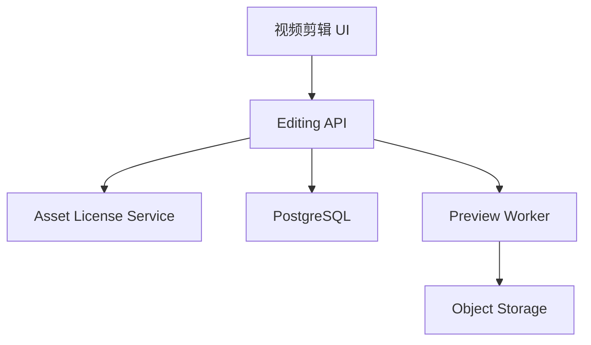

# Design: voflow-advanced-editing

## Overview

高级剪辑不重新渲染数字人，只基于 avatar_video 生成剪辑配置和低成本预览。最终 FFmpeg 合成由 packaging-export 执行。

## Architecture



## Data Model

```sql
editing_configs(
  id, job_id, subtitle_enabled, keyword_highlight_enabled,
  bgm_ducking_enabled, pip_enabled, pip_asset_id,
  pip_position, pip_size, background_asset_id,
  voice_volume, bgm_volume, transition_strength,
  config_json, preview_artifact_id, created_at, updated_at
)
```

Validation:

1. `pip_position` SHALL be one of `top_left`, `top_right`, `bottom_left`, `bottom_right`.
2. `pip_size` SHALL be between 10 and 60.
3. `voice_volume` and `bgm_volume` SHALL be between 0 and 100.

## API

| Method | Path | Purpose |
| --- | --- | --- |
| GET | `/api/video-jobs/{jobId}/editing-config` | 查询剪辑配置 |
| PUT | `/api/video-jobs/{jobId}/editing-config` | 保存剪辑配置 |
| POST | `/api/video-jobs/{jobId}/editing-preview` | 生成剪辑预览 |

## Error Handling

1. 未授权画中画素材返回 `PIP_ASSET_LICENSE_NOT_APPROVED`。
2. 未授权背景素材返回 `BACKGROUND_ASSET_LICENSE_NOT_APPROVED`。
3. 预览生成失败返回 `EDITING_PREVIEW_FAILED`。
