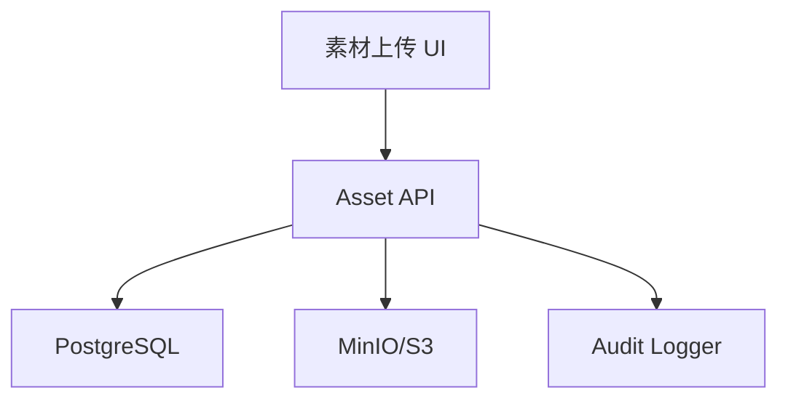

# Design: voflow-assets-compliance

## Overview

素材系统统一管理所有输入文件和生成产物的来源、权限、授权状态和访问路径。合规授权不只服务发布，也服务自拍数字人和声音克隆等高风险能力。

## Architecture



## Components

| Component | Responsibility | Requirements |
| --- | --- | --- |
| Asset API | 上传、查询、删除素材 | US-1 |
| Storage Adapter | 生成对象路径、上传、签名访问 | US-1, US-4 |
| License Service | 保存授权确认和授权状态 | US-2 |
| Audit Logger | 记录上传、授权、删除 | US-3 |
| Asset UI | 素材列表、上传、授权状态展示 | US-1, US-2 |

## Data Model

```sql
assets(
  id, team_id, owner_id, type, name, storage_url, mime_type,
  size_bytes, metadata_json, license_status, created_at, updated_at, deleted_at
)

asset_consents(
  id, asset_id, team_id, user_id, consent_type, consent_text,
  usage_scope, ip_address, device_json, created_at
)

audit_logs(
  id, team_id, user_id, action, target_type, target_id,
  metadata_json, created_at
)
```

Validation:

1. `assets.type` SHALL be one of `image`, `audio`, `video`, `subtitle`, `bgm`, `cover`, `avatar_source`, `artifact`.
2. `assets.license_status` SHALL be one of `pending`, `approved`, `rejected`, `expired`.
3. `asset_consents.usage_scope` SHALL include allowed scenario values, for example `video_generation`, `avatar_generation`, `publishing`.

## API

| Method | Path | Purpose |
| --- | --- | --- |
| POST | `/api/assets` | 上传素材 |
| GET | `/api/assets` | 查询素材列表 |
| GET | `/api/assets/{assetId}` | 查询素材详情 |
| DELETE | `/api/assets/{assetId}` | 软删除素材 |
| POST | `/api/assets/{assetId}/consents` | 确认素材授权 |
| GET | `/api/audit-logs` | 查询审计日志 |

## Error Handling

1. 不支持文件类型返回 `ASSET_UNSUPPORTED_TYPE`。
2. 文件过大返回 `ASSET_SIZE_LIMIT_EXCEEDED`。
3. 对象存储上传失败返回 `ASSET_STORAGE_FAILED`，不得创建可用素材。
4. 未授权素材被业务流程引用时返回 `ASSET_LICENSE_NOT_APPROVED`。

## Design Decisions

1. 素材采用软删除，保证历史任务可追溯。
2. 授权记录独立成表，后续头像、声音、BGM 可以复用。
3. 对象路径包含 teamId，便于权限隔离和后续迁移到云对象存储。
