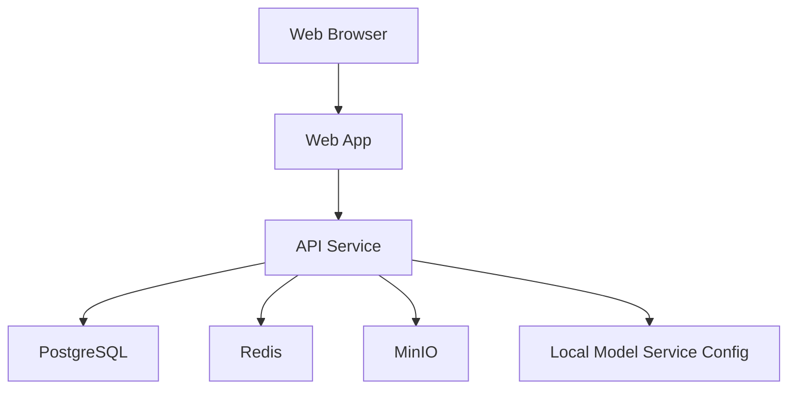

# Design: voflow-foundation

## Overview

`voflow-foundation` 提供平台最小业务壳。MVP 可采用单体 Web/API 结构，但必须保留后续拆分空间。推荐技术栈：Next.js 或等价 Web 框架、FastAPI/NestJS 二选一、PostgreSQL、Redis、MinIO。

## Architecture



## Components

| Component | Responsibility | Requirements |
| --- | --- | --- |
| Web App | 登录页、Dashboard、左侧导航、项目列表、项目创建 | US-1, US-2, US-3 |
| Auth API | 登录、退出、会话校验、用户状态校验 | US-1 |
| Project API | 项目创建、查询、权限过滤 | US-2, US-3 |
| Bootstrap | Docker Compose、本地 env、迁移脚本 | US-4 |
| Health Check | API/DB/Redis/MinIO 可用性检查 | US-4 |
| Model Config | 本地 LLM/TTS/ASR/数字人服务地址配置 | US-4 |

## Navigation

MVP shell SHALL provide these top-level routes:

1. 创作工作台
2. 爆款提取
3. 文案库
4. 我的声音
5. 我的数字人
6. 视频任务
7. 发布中心
8. 素材库
9. 本地模型
10. 设置

## Data Model

```sql
users(id, email, phone, password_hash, name, status, created_at, updated_at)
teams(id, name, owner_id, created_at, updated_at)
team_members(id, team_id, user_id, role, created_at)
projects(id, team_id, owner_id, name, target_platform, aspect_ratio, status, created_at, updated_at)
```

Validation:

1. `users.status` SHALL be one of `active`, `disabled`.
2. `team_members.role` SHALL be one of `owner`, `admin`, `member`.
3. `projects.aspect_ratio` SHALL be one of `9:16`, `16:9`, `1:1`.
4. `projects.status` SHALL be one of `active`, `archived`.

## API

| Method | Path | Purpose |
| --- | --- | --- |
| POST | `/api/auth/login` | 创建会话 |
| POST | `/api/auth/logout` | 退出登录 |
| GET | `/api/me` | 当前用户信息 |
| GET | `/api/projects` | 项目列表 |
| POST | `/api/projects` | 创建项目 |
| GET | `/api/health` | 健康检查 |

## Error Handling

1. 登录失败返回 `AUTH_INVALID_CREDENTIALS`。
2. disabled 用户返回 `AUTH_USER_DISABLED`。
3. 未登录访问返回 401。
4. 无项目权限返回 404，避免泄露项目存在性。
5. 依赖不可用时健康检查返回具体 dependency 状态。

## Design Decisions

1. MVP 默认每个用户创建个人团队，后续企业团队不需要重构资源归属。
2. 项目权限从第一天绑定 team，避免后续素材和任务迁移。
3. 健康检查拆分 dependency 状态，方便 AI Worker 接入后定位基础设施问题。
4. 本地模型服务只通过环境变量注入基础配置，具体调用逻辑留给各 AI Spec 实现。
