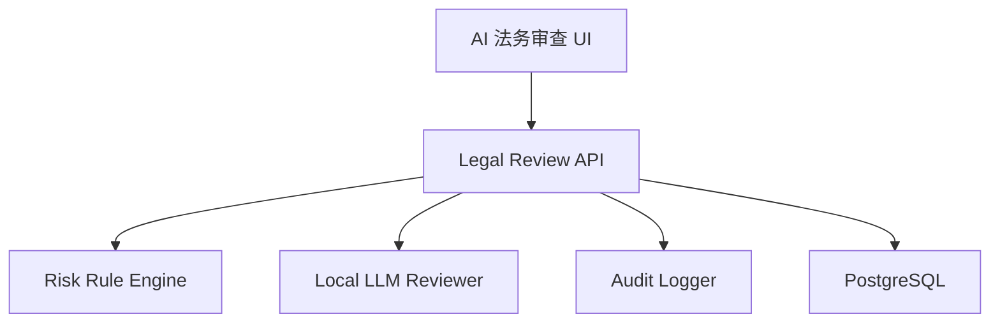

# Design: voflow-legal-review

## Overview

AI 法务审查由规则词库和本地 LLM 审查组合完成。规则词库负责确定性风险，本地 LLM 负责解释风险原因和生成替换建议。所有用户处理动作必须可审计。

## Architecture



## Data Model

```sql
legal_reviews(
  id, script_candidate_id, job_id, status, summary_json,
  reviewed_script, resolved_script, created_at, updated_at
)

legal_risk_items(
  id, legal_review_id, risk_type, severity, original_text,
  reason, suggestion, action, ignored_reason, created_at, updated_at
)
```

Validation:

1. `risk_type` SHALL be one of `forbidden`, `sensitive`, `exaggeration`, `copyright`, `fact`, `platform_rule`.
2. `severity` SHALL be one of `low`, `medium`, `high`.
3. `action` SHALL be one of `pending`, `replaced`, `ignored`, `confirmed_safe`.

## API

| Method | Path | Purpose |
| --- | --- | --- |
| POST | `/api/script-candidates/{candidateId}/legal-review` | 创建审查 |
| GET | `/api/legal-reviews/{reviewId}` | 查询审查结果 |
| POST | `/api/legal-reviews/{reviewId}/replace-all` | 一键替换 |
| POST | `/api/legal-risk-items/{itemId}/resolve` | 逐条确认或忽略 |

## Error Handling

1. 规则引擎失败返回 `LEGAL_RULE_ENGINE_FAILED`。
2. LLM 审查失败返回 `LEGAL_LLM_REVIEW_FAILED`。
3. 高风险未处理进入 TTS 返回 `LEGAL_HIGH_RISK_UNRESOLVED`。
