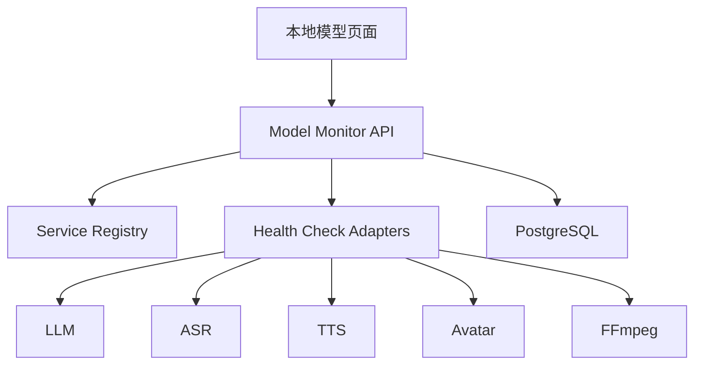

# Design: voflow-local-model-monitor

## Overview

本地模型监控模块提供统一的服务注册表和健康检查接口。各 AI Worker 不直接硬编码服务地址，而是从配置服务读取当前可用的本地服务。

## Architecture



## Data Model

```sql
local_model_services(
  id, service_type, name, base_url, model_name, status,
  latency_ms, resource_json, last_error_json, checked_at, created_at, updated_at
)
```

Validation:

1. `service_type` SHALL be one of `llm`, `asr`, `tts`, `avatar`, `ffmpeg`.
2. `status` SHALL be one of `online`, `offline`, `busy`, `misconfigured`.

## API

| Method | Path | Purpose |
| --- | --- | --- |
| GET | `/api/local-model-services` | 查询服务状态 |
| POST | `/api/local-model-services/{serviceType}/health` | 检查单服务 |
| POST | `/api/local-model-services/health-all` | 检查全部服务 |

## Error Handling

1. 服务地址缺失返回 `LOCAL_SERVICE_MISCONFIGURED`。
2. 服务超时返回 `LOCAL_SERVICE_TIMEOUT`。
3. 服务模型未加载返回 `LOCAL_MODEL_NOT_LOADED`。
