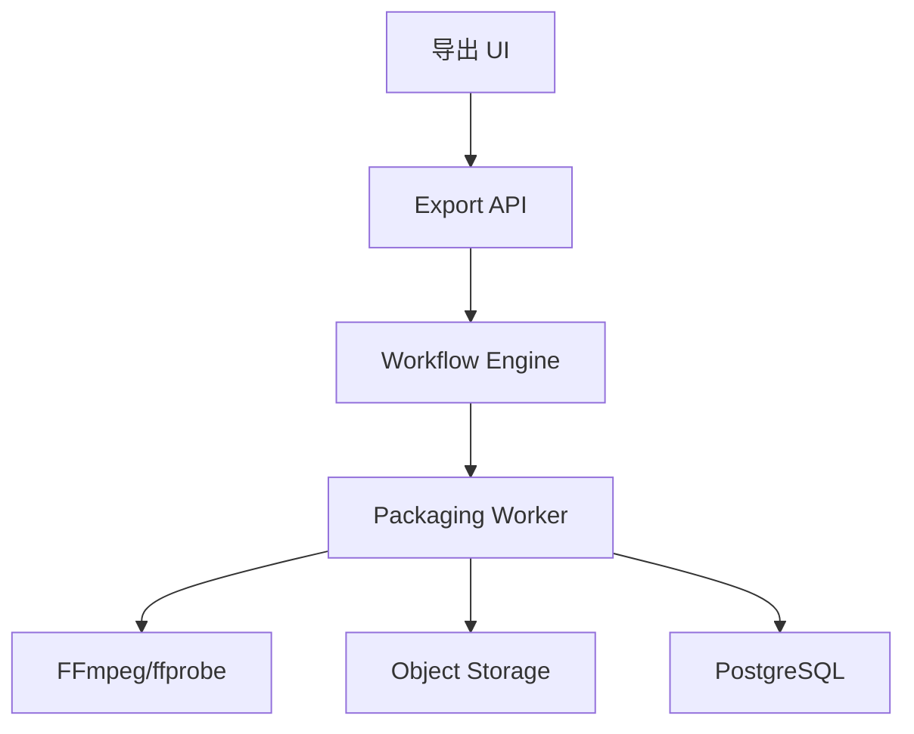

# Design: voflow-packaging-export

## Overview

包装导出模块基于 FFmpeg/ffprobe 完成字幕、音频混流、封面和最终 MP4。该模块应该避免触发数字人重渲染，因此所有字幕、BGM 和封面变化只重跑包装节点。

## Architecture



## Components

| Component | Responsibility | Requirements |
| --- | --- | --- |
| Subtitle Service | 生成 SRT/ASS，字幕样式 | US-1 |
| Audio Mix Service | BGM 授权校验、ducking、混音 | US-2 |
| Cover Service | 抽帧、标题图层、封面 artifact | US-3 |
| Export Worker | FFmpeg 合成最终 MP4 | US-4 |
| Download API | 受控下载 URL | US-4 |
| E2E Runner | MVP 主线验收脚本 | US-5 |

## FFmpeg Pipeline

```text
avatar_video.mp4
 + voice.wav
 + optional bgm.mp3
 + subtitle.ass
 -> final_720p.mp4 / final_1080p.mp4
```

## Data Model

```sql
export_requests(
  id, job_id, node_id, avatar_video_artifact_id, audio_artifact_id,
  editing_config_id, subtitle_artifact_id, bgm_asset_id, cover_artifact_id,
  output_profile, status, created_at
)
```

Validation:

1. `output_profile` SHALL be one of `mp4_720p`, `mp4_1080p`.
2. final video SHALL contain one video stream and one audio stream.
3. final video duration SHALL be within 1000ms of voice audio duration unless configured otherwise.

## API

| Method | Path | Purpose |
| --- | --- | --- |
| POST | `/api/video-jobs/{jobId}/export` | 创建最终导出 |
| GET | `/api/video-jobs/{jobId}/export` | 查询导出产物 |
| GET | `/api/artifacts/{artifactId}/download` | 获取下载 URL |

## Error Handling

1. 字幕生成失败返回 `SUBTITLE_GENERATION_FAILED`。
2. BGM 未授权返回 `BGM_LICENSE_NOT_APPROVED`。
3. FFmpeg 失败返回 `EXPORT_FFMPEG_FAILED`。
4. ffprobe 校验失败返回 `EXPORT_MEDIA_VALIDATION_FAILED`。

## Design Decisions

1. 包装节点独立于数字人渲染，降低反复调字幕/BGM/画中画/背景的 GPU 成本。
2. ffprobe 作为导出验收的一部分，避免空文件、黑屏、无声视频进入下载。
3. 下载使用受控 URL，后续可接入权限和有效期。
