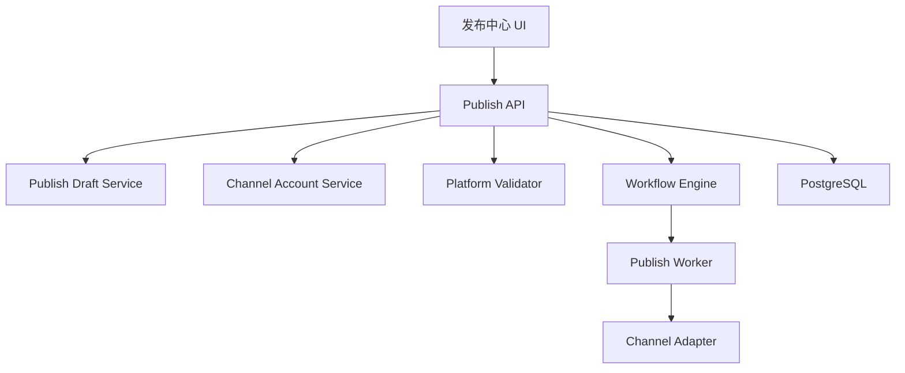

# Design: voflow-publish-assistant

## Overview

发布辅助由发布信息生成、渠道账号、发布参数检查和发布 Worker 组成。MVP 可以先实现 mock channel adapter 和可插拔接口，再逐步接入真实开放平台。

## Architecture



## Data Model

```sql
channel_accounts(id, team_id, user_id, platform, account_name, encrypted_token, status, expires_at, created_at, updated_at)
publish_drafts(id, job_id, platform, title, description, tags_json, topics_json, cover_artifact_id, validation_json, created_at, updated_at)
publishes(id, job_id, publish_draft_id, channel_account_id, platform, status, request_id, remote_id, error_json, created_at, updated_at)
```

Validation:

1. `platform` SHALL be one of `douyin`, `kuaishou`, `xiaohongshu`, `wechat_channels`, `bilibili`, `youtube_shorts`, `tiktok`.
2. `channel_accounts.status` SHALL be one of `connected`, `expired`, `revoked`, `not_connected`.
3. `publishes.status` SHALL be one of `pending`, `uploading`, `published`, `failed`, `skipped`.

## API

| Method | Path | Purpose |
| --- | --- | --- |
| POST | `/api/video-jobs/{jobId}/publish-drafts/generate` | 生成发布草稿 |
| GET | `/api/video-jobs/{jobId}/publish-drafts` | 查询平台草稿 |
| PUT | `/api/publish-drafts/{draftId}` | 修改草稿 |
| GET | `/api/channel-accounts` | 查询授权账号 |
| POST | `/api/video-jobs/{jobId}/publish/validate` | 发布参数检查 |
| POST | `/api/video-jobs/{jobId}/publish` | 一键发布 |
| POST | `/api/publishes/{publishId}/retry` | 重试失败平台 |

## Error Handling

1. 授权过期返回 `CHANNEL_TOKEN_EXPIRED`。
2. 参数不合法返回 `PUBLISH_VALIDATION_FAILED`。
3. 平台上传失败返回 `PUBLISH_UPLOAD_FAILED`。
4. 平台发布失败返回 `PUBLISH_REMOTE_FAILED`。
