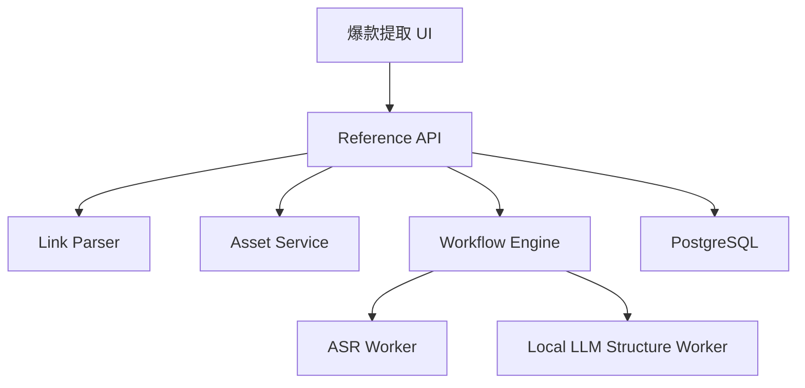

# Design: voflow-reference-extract

## Overview

参考内容提取模块支持链接导入和文件上传两条路径。平台解析能力必须有降级方案：链接失败时，用户可以上传视频/音频或直接粘贴文案。

## Architecture



## Data Model

```sql
reference_sources(
  id, project_id, team_id, source_type, platform, source_url,
  asset_id, status, duration_ms, transcript_script_id,
  structure_json, error_json, created_at
)
```

## API

| Method | Path | Purpose |
| --- | --- | --- |
| POST | `/api/projects/{projectId}/references/from-url` | 从链接创建参考提取 |
| POST | `/api/projects/{projectId}/references/from-asset` | 从素材创建参考提取 |
| GET | `/api/references/{referenceId}` | 查询提取结果 |

## Error Handling

1. 不支持平台返回 `REFERENCE_PLATFORM_UNSUPPORTED`。
2. 链接解析失败返回 `REFERENCE_PARSE_FAILED`。
3. ASR 失败返回 `REFERENCE_ASR_FAILED`。
4. 结构分析失败返回 `REFERENCE_STRUCTURE_FAILED`。
