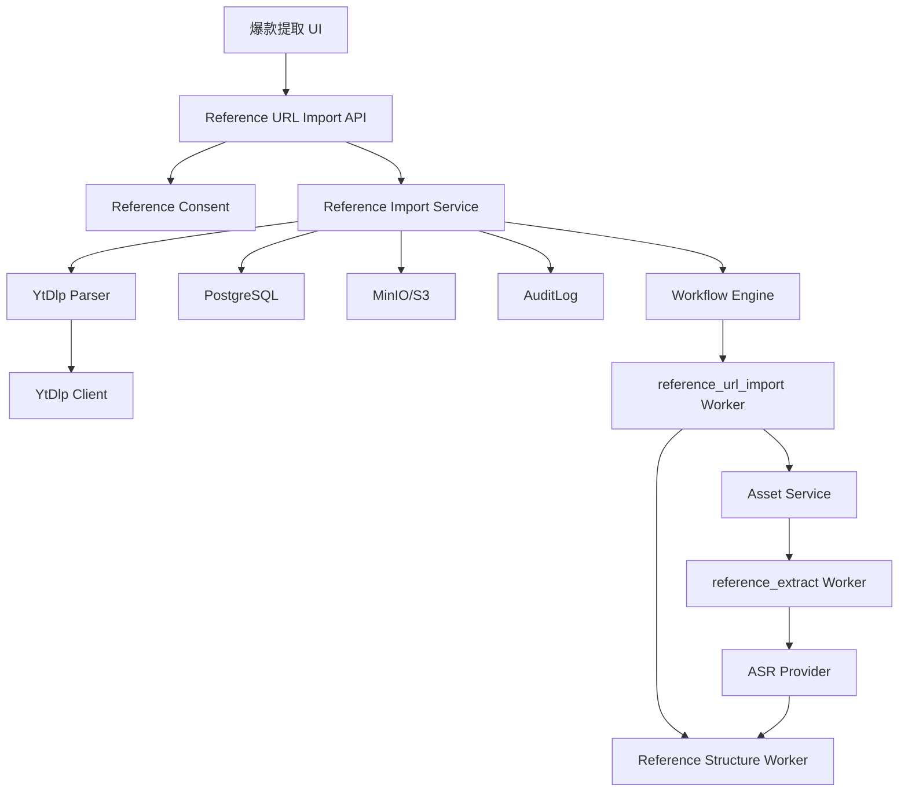

# Design: voflow-reference-url-import

## Overview

参考链接真实导入模块补齐公开 URL 到 VoFlow 参考分析链路的缺口。该模块不把 VoFlow 包装为下载器；它只在用户确认合规用途后，通过 yt-dlp 获取 metadata、字幕或音频，并复用现有 `ReferenceSource`、`AssetConsent`、`reference_extract`、ASR 和结构分析能力。

MVP 分三层交付：

1. metadata only：识别公开链接并展示标题、时长、封面、字幕可用性。
2. subtitle only：优先下载字幕，生成 `Script` 和 `AsrSegment` 后进入结构分析。
3. audio extract：无字幕时，授权后仅提取音频并复用现有 ASR。

## Architecture



## Components

| Component | Responsibility | Requirements |
| --- | --- | --- |
| `ytDlpClient` | 使用 `spawn` 调用 yt-dlp，并处理 timeout、stdout/stderr 限制和版本读取 | US-1, NFR-1, NFR-2 |
| `ytDlpParser` | 实现 `ReferenceLinkParser`，把 yt-dlp metadata 规范化为 `ReferenceLinkParsedData` | US-1 |
| `metadataNormalizer` | 提取 title、durationMs、thumbnailUrl、subtitles、automaticCaptions、extractor 和 raw summary | US-1 |
| `subtitle` 工具 | 选择字幕轨道、解析 VTT/SRT、生成纯文本和 `AsrSegment` | US-2 |
| `referenceImportService` | 编排 metadata、subtitle 和 audio 导入，写入 DB、Storage、AuditLog 和 Workflow | US-1, US-2, US-3, US-4 |
| `reference_url_import` Worker | 异步执行字幕下载或音频提取，避免 API route 长时间阻塞 | US-2, US-3 |
| `Reference UI` | 展示 metadata、授权确认、导入模式和失败兜底 | US-1, US-2, US-3, US-4 |

## Data Model

### ReferenceSource Extension

```sql
reference_sources(
  id, project_id, team_id, source_type, platform, source_url,
  asset_id, status, duration_ms, transcript_script_id,
  title, thumbnail_url, metadata_json, subtitle_json,
  import_mode, consent_status, consent_confirmed_at, consent_confirmed_by,
  structure_json, error_json, created_at, updated_at
)
```

Validation:

1. `import_mode` SHALL be one of `metadata_only`, `subtitle_only`, `audio_extract`, `uploaded_asset`.
2. `consent_status` SHALL be one of `pending`, `confirmed`, `rejected`.
3. `metadata_json` SHALL store normalized metadata and a bounded raw summary, not full unbounded yt-dlp output.
4. `structure_json` SHALL remain the LLM structure analysis output and SHALL NOT be used as metadata storage.

### AssetConsent

No table change is required for MVP. `asset_consents.usage_scope` SHALL support `reference_analysis_only`.

Validation:

1. Audio imported from public URLs SHALL be created with `usageScope=["reference_analysis_only"]`.
2. Public URL imported assets SHALL NOT satisfy `voice_clone_allowed`, `avatar_allowed`, `generation_allowed` or `publish_allowed` checks unless a future explicit consent flow adds that scope.

### Artifact

Subtitles and downloaded thumbnail files can be stored as workflow artifacts when the implementation needs object persistence. MVP may store remote thumbnail URL in `thumbnail_url` and subtitle summary in `subtitle_json`.

## Configuration

New settings SHALL be centralized in the config module and `.env.example`:

```env
VOFLOW_REFERENCE_LINK_IMPORT_ENABLED=false
VOFLOW_YTDLP_BIN=yt-dlp
VOFLOW_YTDLP_TIMEOUT_MS=60000
VOFLOW_REFERENCE_MAX_DURATION_MS=180000
VOFLOW_REFERENCE_MAX_AUDIO_MB=50
VOFLOW_REFERENCE_MAX_METADATA_BYTES=2097152
VOFLOW_REFERENCE_MAX_SUBTITLE_BYTES=5242880
VOFLOW_REFERENCE_ALLOW_AUDIO_EXTRACT=true
VOFLOW_REFERENCE_ALLOW_FULL_VIDEO_DOWNLOAD=false
VOFLOW_REFERENCE_ALLOWED_PLATFORMS=youtube,bilibili
```

Default behavior:

1. Full video download is disabled and has no MVP UI entry.
2. Cookie or login-state import is unsupported.
3. Supported platform list is allowlist-based. Unsupported platforms keep the upload/paste fallback.

## API

| Method | Path | Purpose |
| --- | --- | --- |
| POST | `/api/projects/{projectId}/references/url/parse` | 创建或更新 URL ReferenceSource，并解析 metadata |
| POST | `/api/projects/{projectId}/references/{referenceSourceId}/import` | 确认授权并选择 `metadata_only`、`subtitle_only` 或 `audio_extract` |
| GET | `/api/references/{referenceSourceId}` | 复用现有参考来源查询，展示 metadata、transcript、structure 和 error |
| GET | `/api/video-jobs/{jobId}` | 复用任务详情展示 `reference_url_import` 或 `reference_extract` 进度 |

API response rules:

1. API SHALL use existing auth, team isolation, unified response helpers and Zod validation.
2. Parse API SHALL NOT download audio or video.
3. Import API SHALL require consent for `subtitle_only` and `audio_extract`.
4. `audio_extract` SHALL enqueue work and return job/node status, not block in the route.

## Workflow

### `reference_url_import`

Input:

```json
{
  "sourceType": "reference_url_import",
  "referenceSourceId": "ref_xxx",
  "projectId": "proj_xxx",
  "teamId": "team_xxx",
  "userId": "user_xxx",
  "sourceUrl": "https://example.com/watch",
  "platform": "youtube",
  "importMode": "subtitle_only"
}
```

Behavior:

1. `metadata_only`: persist metadata and finish.
2. `subtitle_only`: download selected subtitle, parse segments, create `Script` and `AsrSegment`, then run reference structure analysis.
3. `audio_extract`: validate consent and limits, extract audio, upload to MinIO, create `Asset` and `AssetConsent(reference_analysis_only)`, then create existing `reference_extract` job/node.

The MVP may reuse the existing reference structure handler directly after subtitle import. If implementation requires cleaner task history, a later refactor may expose `reference_structure` as its own workflow node.

## Correctness Properties

1. For US-1, a successful metadata parse SHALL leave `ReferenceSource.status=metadata_ready` and SHALL NOT create audio/video assets.
2. For US-2, a successful subtitle import SHALL create one `Script` and zero or more ordered `AsrSegment` records tied to the same `ReferenceSource`.
3. For US-3, `audio_extract` SHALL create an audio `Asset` only after consent and limit checks pass.
4. For US-4, imported public-link media SHALL be unusable by voice clone, avatar generation and publish flows unless a separate future consent scope explicitly allows it.
5. For NFR-1, no command invocation path SHALL concatenate a shell command string with user-provided URL.

## Error Handling

| Condition | Code | Recovery |
| --- | --- | --- |
| Feature disabled | `REFERENCE_URL_IMPORT_DISABLED` | Show upload/paste fallback |
| Platform not allowed | `REFERENCE_URL_PLATFORM_UNSUPPORTED` | Show upload/paste fallback |
| yt-dlp missing | `REFERENCE_YTDLP_UNAVAILABLE` | Show setup guidance and upload fallback |
| yt-dlp timeout | `REFERENCE_YTDLP_TIMEOUT` | Retry or upload fallback |
| Metadata too large or invalid | `REFERENCE_METADATA_INVALID` | Upload/paste fallback |
| Consent missing | `REFERENCE_IMPORT_CONSENT_REQUIRED` | Ask user to confirm reference-analysis-only consent |
| Duration exceeded | `REFERENCE_DURATION_LIMIT_EXCEEDED` | Reject import and show limit |
| Subtitle unavailable | `REFERENCE_SUBTITLE_UNAVAILABLE` | Offer audio extract if enabled |
| Subtitle parse failed | `REFERENCE_SUBTITLE_PARSE_FAILED` | Offer audio extract or upload fallback |
| Audio too large | `REFERENCE_AUDIO_SIZE_LIMIT_EXCEEDED` | Reject import |
| Full video requested | `REFERENCE_FULL_VIDEO_DOWNLOAD_UNSUPPORTED` | Reject with MVP boundary message |

Failures SHALL write `ReferenceSource.errorJson` and `AuditLog` where team/user context is available.

## Design Decisions

1. yt-dlp is called as an external binary instead of vendoring source code because extractor rules change frequently and the Next.js/TypeScript service should depend on a narrow client boundary.
2. Metadata and subtitles are prioritized before audio because they reduce storage, local model cost and compliance exposure.
3. Full video download, cookie import, no-watermark workflows and batch channel import are excluded because they make VoFlow look like a downloader and increase platform/legal risk.
4. Public URL imported media defaults to `reference_analysis_only` because VoFlow also contains voice clone and digital avatar features with higher consent requirements.
5. `voflow-reference-extract` remains the base capability; this Spec adds a URL import adapter and reuses existing ASR/structure analysis instead of duplicating those workers.
