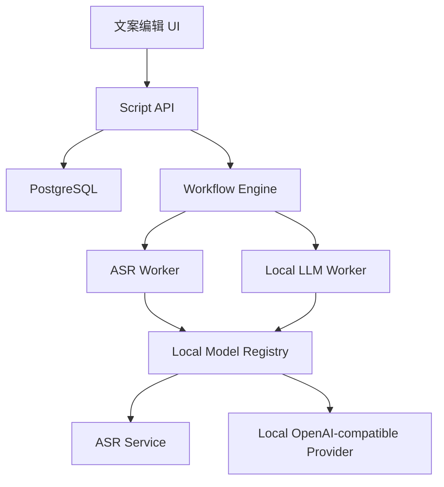

# Design: voflow-script-ai

## Overview

文案能力由 Script API、ASR Worker、本地 LLM Worker 和 Risk Checker 组成。MVP 默认接本地大模型服务，不依赖线上大模型 API。推荐本地模型通过 Ollama、vLLM 或 llama.cpp 暴露 OpenAI-compatible HTTP 接口。业务侧只依赖统一 Provider Adapter，并从 `voflow-local-model-monitor` 已建立的本地模型服务注册表读取 `llm`/`asr` 的 `baseUrl`、`modelName` 和状态。

## Architecture



## Components

| Component | Responsibility | Requirements |
| --- | --- | --- |
| Script API | 保存文案、版本、候选 | US-1, US-3 |
| ASR Worker | 通过本地模型注册表消费 `asr` 服务，输出转写文本和 segments | US-2 |
| Rewrite Worker | 调用本地 LLM 生成候选文案 | US-3, US-5 |
| Title Worker | 生成标题和标签候选 | US-4 |
| Risk Checker | 敏感词和基础风险报告 | US-4 |
| Local LLM Provider | 通过本地模型注册表消费 `llm` 服务，处理请求参数和错误映射 | US-3, US-4, US-5 |

## Data Model

```sql
scripts(id, project_id, job_id, source_type, content, metadata_json, version, status, created_at)
script_candidates(id, script_id, content, title_candidates_json, risk_report_json, model_name, prompt_json, version, created_at)
asr_segments(id, script_id, start_ms, end_ms, text, created_at)
local_model_services(id, service_type, base_url, model_name, status, latency_ms, last_error_json, checked_at)
```

## API

| Method | Path | Purpose |
| --- | --- | --- |
| POST | `/api/projects/{projectId}/scripts` | 保存粘贴文案 |
| POST | `/api/projects/{projectId}/scripts/from-media` | 创建转写任务 |
| POST | `/api/scripts/{scriptId}/rewrite` | 创建改写任务 |
| GET | `/api/scripts/{scriptId}` | 查询文案和候选 |
| POST | `/api/script-candidates/{candidateId}/approve` | 确认候选文案 |
| GET | `/api/local-model-services` | 读取本地 LLM/ASR 服务注册状态 |
| POST | `/api/local-model-services/{serviceType}/health` | 刷新本地 LLM/ASR 服务健康状态 |

## Error Handling

1. 文案为空返回 `SCRIPT_EMPTY`。
2. 文案过长返回 `SCRIPT_LENGTH_LIMIT_EXCEEDED`。
3. ASR 文件时长超限返回 `ASR_DURATION_LIMIT_EXCEEDED`。
4. 本地 LLM 注册状态不可用或健康检查失败时，业务错误映射为 `LOCAL_LLM_UNAVAILABLE`，节点可重试。
5. 本地 LLM 调用超时映射为 `LOCAL_LLM_TIMEOUT`，节点可重试。
6. 本地 ASR 注册状态不可用或健康检查失败时，业务错误映射为 `LOCAL_ASR_UNAVAILABLE`，节点可重试。
7. 风险命中不阻断保存，但必须阻断自动推进到 TTS。
8. 未显式启用外部 provider 时，任何线上模型配置缺失都不得阻断本地文案流程。

## Design Decisions

1. 原始文案和候选文案分表保存，保证可回滚。
2. 风险检查不直接删除内容，交给人工确认，避免误杀。
3. ASR segments 独立存储，后续可用于字幕对齐优化。
4. 本地 LLM 采用 OpenAI-compatible 接口，是为了让 Ollama、vLLM、llama.cpp 和后续模型服务可以无侵入切换。
5. LLM/ASR 地址、模型名、状态文案和健康检查不在本 Spec 重新定义，统一复用 `voflow-local-model-monitor`，避免 Batch 2 多条链路散写模型配置。
6. 默认禁止线上大模型调用，是为了满足本地部署、数据不出内网和低长期成本要求。
