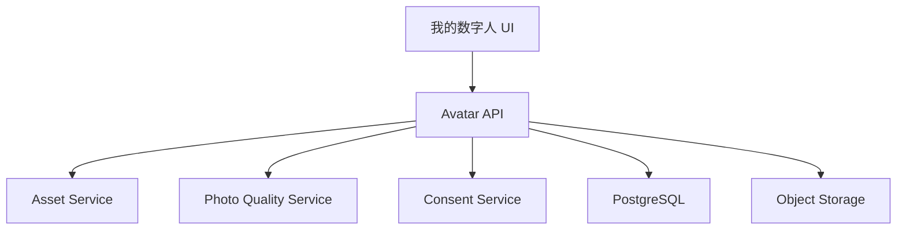

# Design: voflow-self-avatar

## Overview

自拍数字人创建流程必须独立于视频渲染流程。该 Spec 只负责从照片创建可复用 avatar 资产，不负责用音频驱动生成视频。

## Architecture



## Components

| Component | Responsibility | Requirements |
| --- | --- | --- |
| Avatar API | 创建、查询、删除数字人 | US-1, US-4 |
| Photo Quality Service | 人脸数量、角度、清晰度、遮挡、曝光检测 | US-2 |
| Consent Service | 肖像授权确认 | US-3 |
| Avatar UI | 上传、质检结果、授权、列表管理 | US-1, US-2, US-3, US-4 |

## Data Model

```sql
avatars(
  id, team_id, owner_id, name, source_asset_id, provider,
  status, license_status, quality_report_json, preview_url,
  metadata_json, created_at, updated_at, deleted_at
)

avatar_consents(
  id, avatar_id, team_id, user_id, consent_type, consent_text,
  usage_scope, ip_address, device_json, created_at
)
```

Validation:

1. `avatars.status` SHALL be one of `draft`, `ready`, `disabled`, `deleted`.
2. `avatars.license_status` SHALL be one of `pending`, `approved`, `rejected`.
3. `quality_report_json.passed` SHALL be true before avatar status becomes `ready`.

## Quality Report

```json
{
  "passed": true,
  "faceCount": 1,
  "resolution": {"width": 1080, "height": 1440},
  "faceBoxRatio": 0.42,
  "yaw": 3.5,
  "pitch": 2.1,
  "roll": 0.8,
  "blurScore": 142.3,
  "occlusion": "none",
  "exposure": "normal",
  "reasons": []
}
```

## API

| Method | Path | Purpose |
| --- | --- | --- |
| POST | `/api/avatars/photo-check` | 上传照片并执行质检 |
| POST | `/api/avatars` | 创建数字人资产 |
| GET | `/api/avatars` | 我的数字人列表 |
| GET | `/api/avatars/{avatarId}` | 数字人详情 |
| DELETE | `/api/avatars/{avatarId}` | 删除数字人 |
| POST | `/api/avatars/{avatarId}/consents` | 确认肖像授权 |

## Error Handling

1. 无人脸返回 `AVATAR_NO_FACE_DETECTED`。
2. 多人脸返回 `AVATAR_MULTIPLE_FACES_DETECTED`。
3. 图片模糊返回 `AVATAR_PHOTO_BLURRY`。
4. 人脸角度过大返回 `AVATAR_FACE_ANGLE_INVALID`。
5. 未授权创建返回 `AVATAR_CONSENT_REQUIRED`。

## Design Decisions

1. 质检结果保存为结构化 JSON，方便 UI 展示具体失败原因。
2. 创建 avatar 前必须先创建 source asset，确保原始照片可追溯。
3. 删除数字人为软删除，历史视频仍可追溯，但新任务不可选择。
