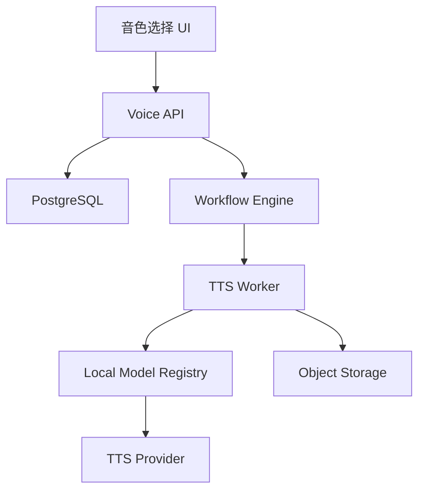

# Design: voflow-tts

## Overview

TTS 模块通过 provider adapter 屏蔽具体实现。MVP 默认使用本地 GPT-SoVITS/CosyVoice 等预置音色服务或 mock provider；商业 TTS 只作为显式启用的可选 provider。本地 TTS 服务地址、状态和健康检查复用 `voflow-local-model-monitor` 的 `tts` 服务注册表。所有生成结果通过 workflow engine 记录状态和 artifact。

## Architecture



## Components

| Component | Responsibility | Requirements |
| --- | --- | --- |
| Voice API | 音色列表、试听样例 | US-1 |
| TTS Worker | 文本转语音、产物上传 | US-2, US-3 |
| TTS Provider Adapter | 从本地模型注册表消费 `tts` 服务，屏蔽商业 API 或本地模型差异 | US-2 |
| Approval UI | 试听、确认、重新生成 | US-4 |

## Data Model

```sql
voices(id, team_id, owner_id, name, provider, model_id, status, license_status, sample_url, metadata_json, created_at)
tts_requests(id, job_id, node_id, voice_id, script_candidate_id, speed, pitch, pause_json, provider, provider_request_id, created_at)
```

Validation:

1. `voices.status` SHALL be one of `active`, `disabled`.
2. `voices.license_status` SHALL be `approved` before use.
3. `speed` SHALL be between 0.5 and 2.0.
4. `pitch` SHALL be between -12 and 12 semitones when provider supports pitch.

## API

| Method | Path | Purpose |
| --- | --- | --- |
| GET | `/api/voices` | 获取可用音色 |
| GET | `/api/voices/{voiceId}` | 获取音色详情 |
| POST | `/api/video-jobs/{jobId}/tts` | 创建 TTS 节点任务 |
| POST | `/api/video-jobs/{jobId}/tts/regenerate` | 重新生成语音 |

## Error Handling

1. 音色不存在或无权限返回 `VOICE_NOT_FOUND`。
2. 音色未授权返回 `VOICE_LICENSE_NOT_APPROVED`。
3. 本地模型注册表中 `tts` 不可用时返回 `TTS_PROVIDER_UNAVAILABLE`。
4. TTS 超时返回 `TTS_TIMEOUT`。
5. Provider 返回非法音频时返回 `TTS_INVALID_AUDIO_OUTPUT`。

## Design Decisions

1. TTS 生成只消费 ready 状态音色；声音克隆训练、授权和重训由 `voflow-voice-clone` 独立负责，避免 TTS 生成链路混入训练复杂度。
2. TTS 输出必须等待用户确认，避免不满意音频直接进入高成本数字人渲染。
3. Provider adapter 从第一天存在，便于本地 GPT-SoVITS/CosyVoice、mock provider 和可选商业 TTS 切换。
4. TTS 服务地址、状态文案和健康检查不在本 Spec 重新定义，统一复用 `voflow-local-model-monitor`，避免语音链路维护第二套模型配置。
