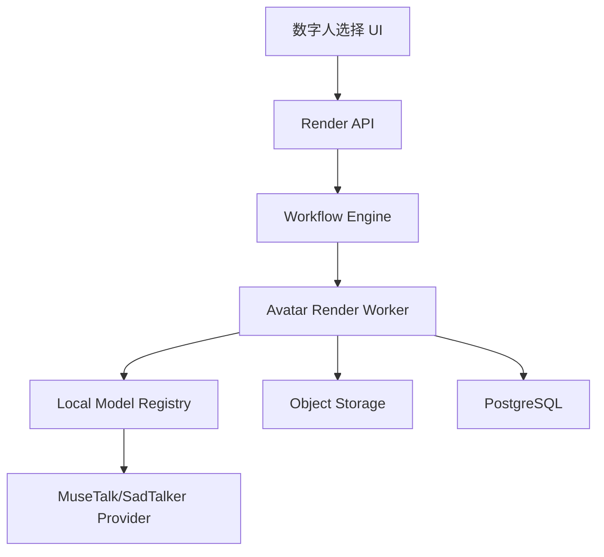

# Design: voflow-video-render

## Overview

数字人渲染通过 Avatar Render Worker 调用 MuseTalk/SadTalker 或 mock provider。MVP 建议先用 mock provider 打通流程，再接真实模型。真实 avatar 服务地址、状态和健康检查复用 `voflow-local-model-monitor` 的 `avatar` 服务注册表。渲染产物写入对象存储并作为 artifact 传给后续包装导出节点。

## Architecture



## Components

| Component | Responsibility | Requirements |
| --- | --- | --- |
| Render API | 校验 avatar/audio/render options，创建节点 | US-1, US-4 |
| Avatar Render Worker | 从本地模型注册表消费 `avatar` 服务并生成口播视频 | US-2, US-3 |
| Model Provider | MuseTalk/SadTalker/mock 统一接口，不重复定义服务地址和状态文案 | US-2, US-3 |
| Preview Approval UI | 播放预览、确认、重试 | US-2, US-3 |

## Render Payload

```json
{
  "jobId": "job_001",
  "avatarId": "avatar_001",
  "sourceImageUrl": "s3://voflow/team/assets/avatar/raw.png",
  "audioUrl": "s3://voflow/team/jobs/job_001/tts/voice.wav",
  "mode": "preview",
  "aspectRatio": "9:16",
  "renderOptions": {
    "crop": "half_body",
    "background": "transparent",
    "resolution": "720p"
  }
}
```

## Data Model

```sql
avatar_render_requests(
  id, job_id, node_id, avatar_id, audio_artifact_id,
  mode, aspect_ratio, crop, provider, provider_request_id,
  created_at
)
```

Validation:

1. `mode` SHALL be one of `preview`, `hd`.
2. `crop` SHALL be one of `head`, `half_body`.
3. `aspect_ratio` SHALL match the project aspect_ratio.

## API

| Method | Path | Purpose |
| --- | --- | --- |
| POST | `/api/video-jobs/{jobId}/avatar-render/preview` | 创建预览渲染 |
| POST | `/api/video-jobs/{jobId}/avatar-render/hd` | 创建高清渲染 |
| GET | `/api/video-jobs/{jobId}/avatar-render` | 查询渲染结果 |

## Error Handling

1. 数字人不可用返回 `AVATAR_NOT_READY`。
2. 音频不存在返回 `TTS_AUDIO_NOT_FOUND`。
3. 本地模型注册表中 `avatar` 不可用或模型服务失败返回 `AVATAR_PROVIDER_UNAVAILABLE`。
4. 模型输出黑屏或空文件返回 `AVATAR_RENDER_INVALID_OUTPUT`。

## Design Decisions

1. 预览和高清作为同一节点的不同版本，减少状态模型复杂度。
2. 模型 provider 接口独立，方便 MuseTalk、SadTalker 和商业 SDK 切换。
3. Avatar 服务地址、状态文案和健康检查不在本 Spec 重新定义，统一复用 `voflow-local-model-monitor`，避免数字人渲染链路维护第二套模型配置。
4. 输出中间视频不烧字幕，避免后续字幕和包装变化触发昂贵的数字人重渲染。
