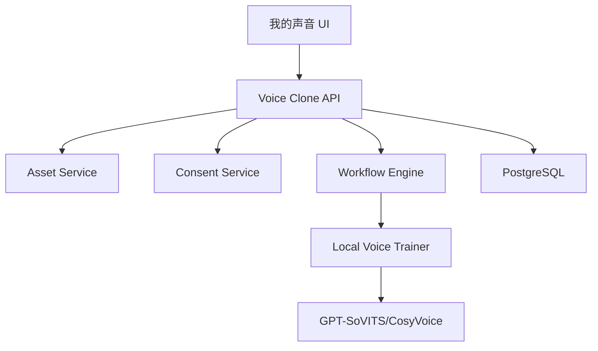

# Design: voflow-voice-clone

## Overview

声音克隆复用素材授权能力和 TTS provider 能力。训练任务进入 workflow engine，产出新的 voice 记录。MVP 支持本地 GPT-SoVITS/CosyVoice provider 或 mock trainer。

## Architecture



## Data Model

```sql
voice_samples(id, asset_id, team_id, owner_id, duration_ms, quality_report_json, created_at)
voice_consents(id, voice_sample_id, team_id, user_id, consent_text, usage_scope, ip_address, device_json, created_at)
voice_clone_jobs(id, workflow_node_id, voice_sample_id, provider, status, output_voice_id, error_json, created_at)
```

## API

| Method | Path | Purpose |
| --- | --- | --- |
| POST | `/api/voices/samples` | 上传声音样本 |
| POST | `/api/voices/samples/{sampleId}/consents` | 确认声音授权 |
| POST | `/api/voices/clone` | 创建声音克隆任务 |
| GET | `/api/voices` | 查询预置和克隆音色 |
| DELETE | `/api/voices/{voiceId}` | 删除音色 |

## Error Handling

1. 样本太短返回 `VOICE_SAMPLE_TOO_SHORT`。
2. 样本噪声过高返回 `VOICE_SAMPLE_NOISY`。
3. 未授权训练返回 `VOICE_CONSENT_REQUIRED`。
4. 训练失败返回 `VOICE_CLONE_TRAINING_FAILED`。
