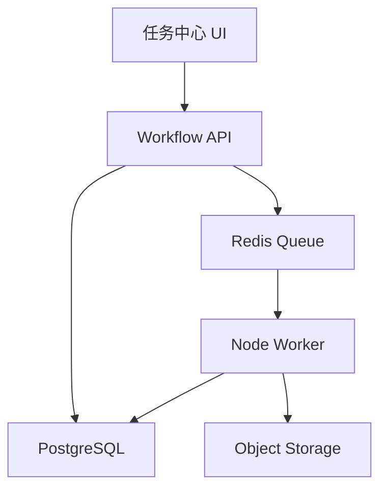

# Design: voflow-workflow-engine

## Overview

工作流引擎采用轻量状态机 + 队列。MVP 可使用 Redis Queue/Celery/BullMQ 任一种实现。每个 AI 节点都是异步任务，节点输出通过 artifacts 或 output_json 保存。

## Architecture



## Workflow Nodes

MVP 默认节点：

1. `reference_extract`
2. `script_prepare`
3. `script_rewrite`
4. `legal_review`
5. `voice_clone`
6. `tts`
7. `avatar_render`
8. `editing_preview`
9. `subtitle`
10. `bgm_mix`
11. `cover`
12. `final_export`
13. `publish`

## State Model

```text
pending -> queued -> running -> succeeded -> waiting_approval -> approved
pending -> queued -> running -> failed
pending -> cancelled
failed -> queued
approved -> queued(next node)
```

## Data Model

```sql
video_jobs(id, project_id, team_id, owner_id, status, current_node, progress, error_code, error_message, created_at, updated_at)
workflow_nodes(id, job_id, node_type, status, version, input_json, output_json, error_json, retry_count, requires_approval, started_at, finished_at)
artifacts(id, job_id, node_id, type, storage_url, metadata_json, created_at)
```

Validation:

1. `workflow_nodes.status` SHALL be one of `pending`, `queued`, `running`, `succeeded`, `failed`, `waiting_approval`, `approved`, `cancelled`.
2. `workflow_nodes.version` SHALL increment when a node is regenerated.
3. `video_jobs.progress` SHALL be between 0 and 100.

## API

| Method | Path | Purpose |
| --- | --- | --- |
| POST | `/api/video-jobs` | 创建视频任务 |
| GET | `/api/video-jobs` | 任务列表 |
| GET | `/api/video-jobs/{jobId}` | 任务详情 |
| POST | `/api/video-jobs/{jobId}/nodes/{nodeId}/retry` | 重试节点 |
| POST | `/api/video-jobs/{jobId}/nodes/{nodeId}/approve` | 确认节点 |
| POST | `/api/video-jobs/{jobId}/cancel` | 取消任务 |

## Error Handling

1. 队列投递失败返回 `WORKFLOW_ENQUEUE_FAILED`。
2. 节点执行超时返回 `WORKFLOW_NODE_TIMEOUT`。
3. 无权限访问任务返回 404。
4. 重试不可重试节点返回 `WORKFLOW_NODE_NOT_RETRYABLE`。
5. 重试节点时必须保留旧版本输出，不得覆盖历史结果。

## Design Decisions

1. 节点版本化用于保证重试和重新生成可追溯。
2. `waiting_approval` 独立于 `succeeded`，避免用户未确认时自动推进高成本或高风险下游任务，例如法务审查、声音生成、高清数字人渲染和发布。
3. 任务中心只依赖 DB 状态，不直接依赖 Worker 内存状态。
