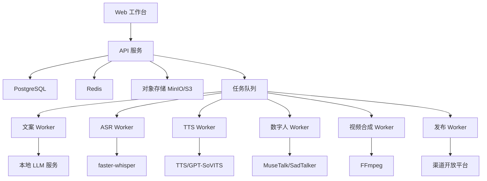

# 智能口播平台开发技术文档

版本：v0.1
日期：2026-06-19
项目代号：VoFlow Platform
调研范围：GitHub 开源项目、用户附文中的 AI 口播生产链路

## 1. 技术结论

建议采用“业务平台 + AI Worker + 模型服务”的组合架构，不建议直接把某个数字人 Demo 改造成完整 SaaS。

推荐路线：

1. MVP 可以二开 [OpenShorts](https://github.com/mutonby/openshorts) 作为视频生产平台底座，补齐中文口播、数字人、任务队列、素材授权和发布适配。
2. 如果希望长期掌控架构，建议从零搭建业务平台，复用开源模型服务：`faster-whisper`、`GPT-SoVITS`、`MuseTalk`、`SadTalker`、`FFmpeg`。
3. 文案改写、标题生成和风险提示默认走本地大模型服务，推荐通过 Ollama、vLLM 或 llama.cpp 暴露 OpenAI-compatible API，业务代码不直接绑定线上大模型。
4. 商业化前必须做许可证复核。`GPT-SoVITS`、`faster-whisper`、`MuseTalk`、`OpenShorts` 当前更适合二开；`Fish-Speech` 和 `Duix-Avatar` 存在商业授权门槛；部分 Wav2Lip 类仓库不适合直接商业化。

## 2. GitHub 开源项目调研

以下数据通过 GitHub API 于 2026-06-19 拉取，星标、更新时间会变化，落地前应重新核对。

### 2.1 平台底座类

| 项目 | 方向 | 语言 | Stars | License | 更新时间 | 二开判断 |
| --- | --- | --- | ---: | --- | --- | --- |
| [mutonby/openshorts](https://github.com/mutonby/openshorts) | AI 短视频平台、Clip Generator、AI Shorts、YouTube Studio | JavaScript | 2414 | MIT | 2026-06-18 | 最适合作为 MVP 平台底座，需补中文口播数字人和国内渠道 |
| [gyoridavid/short-video-maker](https://github.com/gyoridavid/short-video-maker) | 面向 TikTok/Reels/Shorts 的短视频生成 REST API/MCP | TypeScript | 1191 | MIT | 2026-06-19 | 适合作为视频自动化生成参考，不是完整 SaaS |
| [PunithVT/ai-avatar-system](https://github.com/PunithVT/ai-avatar-system) | 上传照片、克隆声音、实时唇形的自托管数字人系统 | Python | 262 | MIT | 2026-06-16 | 可作为数字人交互链路参考，社区规模较小 |
| [Kedreamix/Linly-Talker](https://github.com/Kedreamix/Linly-Talker) | LLM + Whisper + TTS + SadTalker 数字人会话系统 | Python | 3365 | MIT | 2026-06-18 | 适合验证“对话式数字人”，不是批量视频生产平台 |
| [SamurAIGPT/AI-Faceless-Video-Generator](https://github.com/SamurAIGPT/AI-Faceless-Video-Generator) | 自动生成脚本、声音和 talking face | Jupyter Notebook | 453 | MIT | 2026-06-16 | 更像实验 Demo，不建议作为主工程底座 |

### 2.2 模型与媒体组件类

| 项目 | 能力 | 语言 | Stars | License | 更新时间 | 二开判断 |
| --- | --- | --- | ---: | --- | --- | --- |
| [SYSTRAN/faster-whisper](https://github.com/SYSTRAN/faster-whisper) | Whisper ASR 加速转写 | Python | 23720 | MIT | 2026-06-19 | 推荐用于音视频转写 |
| [RVC-Boss/GPT-SoVITS](https://github.com/RVC-Boss/GPT-SoVITS) | 少样本声音克隆和 TTS | Python | 58823 | MIT | 2026-06-18 | 推荐用于二期声音克隆 PoC |
| [TMElyralab/MuseTalk](https://github.com/TMElyralab/MuseTalk) | 实时高质量唇形同步 | Python | 6005 | MIT | 2026-06-18 | 推荐用于数字人视频生成 PoC |
| [OpenTalker/SadTalker](https://github.com/OpenTalker/SadTalker) | 单图驱动 talking head | Python | 13905 | Apache-2.0 | 2026-06-18 | 适合非实时高清口播生成 |
| [duixcom/Duix-Avatar](https://github.com/duixcom/Duix-Avatar) | 离线数字人生成和克隆工具包 | C | 13680 | DUIX Community License | 2026-06-18 | 能力强，但超过 1000 MAU 等场景需商业授权，不建议直接作为商业 MVP 核心依赖 |
| [fishaudio/fish-speech](https://github.com/fishaudio/fish-speech) | TTS | Python | 30861 | Fish Audio Research License | 2026-06-18 | 非商业/研究友好，商业用途需单独授权 |

### 2.3 推荐二开组合

首选组合：

1. Web/平台底座：OpenShorts 或自研 Next.js + FastAPI。
2. ASR：faster-whisper。
3. LLM：本地大模型优先，通过 Ollama/vLLM/llama.cpp 的 OpenAI-compatible endpoint 接入；可选模型按显存选择 Qwen/DeepSeek/Llama 系列。
4. TTS：本地部署优先使用 GPT-SoVITS/CosyVoice 等本地预置音色；商业 TTS API 只作为可选 provider。
5. 数字人：MuseTalk 用于实时/快速预览，SadTalker 用于非实时高清生成。
6. 合成：FFmpeg + Python Worker。
7. 存储：PostgreSQL + Redis + MinIO/S3。
8. 队列：Redis Queue/Celery 起步，规模化后换 RabbitMQ/Kafka/Temporal。

不建议：

1. 不建议把 Duix-Avatar 作为核心商业依赖，除非先拿到商业授权。
2. 不建议把 Notebook Demo 当生产后端。
3. 多平台发布在原型对齐版本中进入开发计划，但建议先实现 mock channel adapter 和发布参数检查，再逐步接真实开放平台。

## 3. 总体架构



## 4. 服务拆分

### 4.1 Web 前端

建议技术：

1. 新项目：Next.js + React + Tailwind/shadcn 或 Ant Design Pro。
2. 二开 OpenShorts：沿用其前端技术栈，先减少重构。

主要页面：

1. 登录/注册。
2. 项目列表。
3. 单视频创作页。
4. 文案编辑页。
5. 音色与数字人选择页。
6. 我的数字人：拍照/上传照片、质量检测、授权确认、预览和资产管理。
7. 任务中心。
8. 素材库。
9. 发布记录。
10. 管理后台。

### 4.2 API 服务

建议技术：

1. Node.js/NestJS：适合账号、项目、权限、素材、发布、计费等业务服务。
2. Python/FastAPI：适合直接封装 AI 推理和媒体处理。
3. MVP 可使用 FastAPI 单后端，后续再拆业务 API 和 AI API。

核心职责：

1. 认证鉴权。
2. 项目、素材、任务、产物的 CRUD。
3. 工作流编排。
4. 任务入队、状态查询、失败重试。
5. 渠道 token 管理。
6. 审计日志和用量统计。

### 4.3 工作流编排

MVP 可自研轻量状态机：

```text
draft
 -> script_ready
 -> voice_ready
 -> avatar_ready
 -> video_ready
 -> cover_ready
 -> publish_ready
 -> published
```

规模化后建议引入 Temporal：

1. 原生支持长任务、重试、补偿和可观测性。
2. 适合“数字人渲染数分钟到数小时”的长耗时工作流。
3. 适合发布网关这种需要幂等和状态同步的流程。

### 4.4 AI Worker

每个 Worker 都应满足统一任务协议：

```json
{
  "jobId": "job_xxx",
  "workflowId": "wf_xxx",
  "node": "tts",
  "input": {},
  "options": {},
  "retry": 0,
  "traceId": "trace_xxx"
}
```

返回统一结果：

```json
{
  "jobId": "job_xxx",
  "status": "succeeded",
  "artifacts": [
    {
      "type": "audio",
      "url": "s3://bucket/path/audio.wav",
      "metadata": {
        "durationMs": 59000,
        "sampleRate": 44100
      }
    }
  ],
  "metrics": {
    "durationMs": 18200,
    "gpuSeconds": 0
  }
}
```

失败结果：

```json
{
  "jobId": "job_xxx",
  "status": "failed",
  "error": {
    "code": "TTS_TIMEOUT",
    "message": "TTS service timed out",
    "retryable": true
  }
}
```

## 5. 核心模块实现

### 5.1 文案提取

输入：

1. `text`：直接粘贴。
2. `media_file`：用户上传音视频。
3. `reference_url`：参考链接。

处理：

1. 文本输入直接进入草稿。
2. 音视频先上传对象存储，再由 ASR Worker 调用 faster-whisper 转写。
3. 参考链接不作为一期强依赖，优先提供手动上传和粘贴，降低平台解析和版权风险。

输出：

1. 原始转写文本。
2. 带时间戳 segments。
3. 结构化摘要：主题、观点、关键词、目标受众。

### 5.2 文案仿写

MVP 默认使用本地大模型，不依赖线上大模型 API。建议把本地大模型封装为 OpenAI-compatible HTTP 服务，业务侧只配置 `base_url`、`model`、`api_key` 占位值、`timeout`、`max_tokens` 和 `temperature`。

推荐本地接入方式：

1. Ollama：部署简单，适合本地开发、PoC 和中小模型。
2. vLLM：吞吐更高，适合 GPU 服务器和多用户并发。
3. llama.cpp：资源占用低，适合 CPU 或低显存机器。

默认策略：

1. `LLM_PROVIDER=local_openai_compatible`。
2. `LLM_BASE_URL=http://localhost:11434/v1` 或内网模型服务地址。
3. 不配置外部模型 provider 时，系统不得调用线上大模型。
4. 本地模型健康检查失败时，文案改写和标题生成节点失败并允许重试。

Prompt 输入：

1. 原始文案。
2. 目标平台。
3. 视频时长。
4. 账号人设。
5. 禁用词和品牌术语。
6. 改写强度。

输出：

1. 3-5 个候选文案。
2. 每个候选的标题建议、风险提示、字数和预计时长。
3. 文案版本号。

### 5.3 TTS 和声音克隆

一期：

1. 使用本地 GPT-SoVITS/CosyVoice 等预置音色；商业 TTS 只作为可选 provider。
2. 支持用户上传声音样本、授权确认、本地训练和克隆音色管理。
3. 重点做音色选择、语速、停顿、试听、重训和删除。

二期：

1. 增加声音授权和身份验证流程。
2. 引入 GPT-SoVITS 训练/微调任务。
3. 每个用户音色独立版本化和权限隔离。

### 5.4 数字人生成

推荐双模型策略：

1. MuseTalk：用于快速预览和唇形同步验证。
2. SadTalker：用于单图驱动的非实时高清输出。

关键工程点：

1. 输入照片必须做人脸检测、分辨率检查、授权确认。
2. 生成任务必须支持低清预览和高清输出两档。
3. Worker 必须把模型权重和临时帧目录与最终产物分开管理。
4. 输出统一为中间 MP4，交给视频合成 Worker 追加字幕、BGM 和封面。

#### 5.4.1 用户上传照片制作数字人

这是平台必须支持的一等能力，不能只做“选择预置数字人”。建议把它拆成“照片质检 -> 授权确认 -> 数字人资产创建 -> 口播驱动”四步。

输入要求：

1. 图片格式：JPG、PNG、WebP。
2. 推荐分辨率：短边不低于 720px。
3. 画面要求：单人正脸、无遮挡、无墨镜、无大幅侧脸、光线均匀。
4. 内容要求：必须是本人或已授权形象，不能上传公众人物、明星、网红或未授权第三方。

照片质检：

1. 人脸数量检测：必须且只能检测到 1 张主脸。
2. 人脸角度检测：yaw/pitch/roll 超过阈值时提示重新拍摄。
3. 清晰度检测：使用 Laplacian variance 或人脸检测置信度过滤模糊照片。
4. 遮挡检测：检测口罩、墨镜、手部遮挡、过暗/过曝。
5. 分辨率和裁剪检测：人脸区域过小、头部被裁切时拒绝。

授权确认：

1. 创建数字人前必须弹出肖像授权确认。
2. 授权记录写入 `avatar_consents` 或 `assets.metadata_json`。
3. 授权内容至少包含：上传人、授权用途、授权范围、确认时间、IP/设备信息。
4. 企业版可增加人工审核状态：`pending_review`、`approved`、`rejected`。

数字人资产创建：

1. 原始照片作为 `asset` 保存。
2. 质检通过后创建 `avatar` 记录，状态为 `ready` 或 `pending_review`。
3. 生成一段 3-5 秒静默/样例口播预览，用于确认脸部裁剪和画面效果。
4. 用户确认后，数字人进入“我的数字人”列表，可被多个视频任务复用。

口播驱动：

1. 视频任务引用 `avatarId`，不要重复上传照片。
2. Avatar Worker 读取头像资产、音频资产和渲染参数。
3. Worker 输出透明背景或已合成背景的中间 MP4。
4. 合成 Worker 再负责字幕、BGM、封面和最终规格输出。

Avatar Worker 输入示例：

```json
{
  "jobId": "job_001",
  "avatarId": "avatar_self_001",
  "sourceImageUrl": "s3://voflow/team_001/assets/avatar_photo/raw.png",
  "audioUrl": "s3://voflow/team_001/jobs/job_001/tts/voice.wav",
  "mode": "preview",
  "aspectRatio": "9:16",
  "renderOptions": {
    "crop": "half_body",
    "background": "transparent",
    "resolution": "720p"
  }
}
```

Avatar Worker 输出示例：

```json
{
  "jobId": "job_001",
  "status": "succeeded",
  "artifacts": [
    {
      "type": "avatar_video",
      "url": "s3://voflow/team_001/jobs/job_001/avatar/avatar_preview.mp4",
      "metadata": {
        "durationMs": 59000,
        "resolution": "720x1280",
        "model": "musetalk"
      }
    }
  ]
}
```

### 5.5 视频合成

使用 FFmpeg 做生产级合成：

1. 数字人视频缩放和裁剪。
2. 背景图/背景视频叠加。
3. 字幕硬烧录。
4. BGM 闪避混音。
5. 封面图生成。
6. 输出多规格 MP4。

推荐产物：

1. `preview.mp4`：低清预览。
2. `final_720p.mp4`：默认下载。
3. `final_1080p.mp4`：高清版本。
4. `subtitle.srt`、`subtitle.ass`。
5. `cover.jpg`。

### 5.6 发布网关

二期后再做。每个平台一个 Channel Adapter：

```text
ChannelAdapter
  authorize()
  refreshToken()
  validatePost()
  uploadVideo()
  setCover()
  publish()
  getStatus()
  revoke()
```

发布前必须做参数校验：

1. 视频比例、大小、时长。
2. 标题长度。
3. 标签数量。
4. 封面尺寸。
5. 用户授权是否有效。

## 6. 数据模型草案

### 6.1 核心表

```sql
users(id, email, phone, name, status, created_at)
teams(id, name, owner_id, created_at)
team_members(id, team_id, user_id, role, created_at)

projects(id, team_id, owner_id, name, target_platform, aspect_ratio, status, created_at)
video_jobs(id, project_id, status, current_node, progress, error_code, error_message, created_at, updated_at)
workflow_nodes(id, job_id, node_type, status, input_json, output_json, retry_count, started_at, finished_at)

assets(id, team_id, owner_id, type, name, storage_url, mime_type, metadata_json, license_status, created_at)
scripts(id, project_id, source_type, content, metadata_json, version, created_at)
voices(id, team_id, owner_id, name, provider, model_id, license_status, metadata_json, created_at)
avatars(id, team_id, owner_id, name, source_asset_id, provider, status, license_status, quality_report_json, preview_url, metadata_json, created_at)
avatar_consents(id, avatar_id, team_id, user_id, consent_type, consent_text, usage_scope, ip_address, device_json, created_at)
artifacts(id, job_id, type, storage_url, metadata_json, created_at)

channel_accounts(id, team_id, user_id, platform, encrypted_token, status, expires_at, created_at)
publishes(id, job_id, channel_account_id, platform, status, request_id, remote_id, error_json, created_at, updated_at)
audit_logs(id, team_id, user_id, action, target_type, target_id, metadata_json, created_at)
usage_records(id, team_id, user_id, job_id, resource_type, quantity, cost_estimate, created_at)
```

### 6.2 对象存储路径

```text
s3://voflow/{team_id}/assets/{asset_id}/raw
s3://voflow/{team_id}/jobs/{job_id}/input/
s3://voflow/{team_id}/jobs/{job_id}/asr/
s3://voflow/{team_id}/jobs/{job_id}/tts/
s3://voflow/{team_id}/jobs/{job_id}/avatar/
s3://voflow/{team_id}/jobs/{job_id}/final/
```

## 7. API 草案

### 7.1 创建视频任务

```http
POST /api/video-jobs
Content-Type: application/json
```

```json
{
  "projectId": "project_001",
  "inputType": "text",
  "text": "这里是口播文案",
  "targetPlatform": "douyin",
  "aspectRatio": "9:16",
  "voiceId": "voice_default_female_01",
  "avatarId": "avatar_default_01",
  "templateId": "template_clean_01"
}
```

### 7.2 查询任务状态

```http
GET /api/video-jobs/{jobId}
```

```json
{
  "id": "job_001",
  "status": "running",
  "currentNode": "avatar",
  "progress": 62,
  "nodes": [
    {"node": "rewrite", "status": "succeeded"},
    {"node": "tts", "status": "succeeded"},
    {"node": "avatar", "status": "running"}
  ]
}
```

### 7.3 重试节点

```http
POST /api/video-jobs/{jobId}/nodes/{nodeId}/retry
```

### 7.4 确认节点结果

```http
POST /api/video-jobs/{jobId}/nodes/{nodeId}/approve
```

## 8. 部署方案

### 8.1 MVP 单机/单 GPU

适合 PoC 和内测：

1. Docker Compose。
2. PostgreSQL。
3. Redis。
4. MinIO。
5. API 服务。
6. Worker 服务。
7. 本地大模型服务。
8. GPU 模型服务。

本地大模型部署要求：

1. 模型服务必须提供内网 HTTP 地址，推荐 OpenAI-compatible `/v1/chat/completions`。
2. API 服务通过环境变量配置本地模型地址，不在代码中写死模型名。
3. 本地模型不可用时，`/api/health` 或独立模型健康检查必须显示失败原因。
4. 默认环境不得要求配置 OpenAI、Claude 等线上模型密钥。

### 8.2 生产环境

适合商业化：

1. Kubernetes。
2. GPU 节点池。
3. PostgreSQL 主从或云数据库。
4. Redis Cluster。
5. S3/OSS。
6. Prometheus + Grafana + Loki。
7. Sentry 或 OpenTelemetry Trace。

### 8.3 GPU 策略

1. ASR、TTS、数字人分别拆 Worker 队列。
2. 数字人高清生成队列限流。
3. 预览任务优先级高于批量高清任务。
4. 支持低峰批处理。

## 9. 开发计划

### 9.1 第 0 阶段：PoC 验证，1-2 周

目标：验证模型链路和成本。

任务：

1. 跑通 faster-whisper 转写。
2. 跑通一个 TTS 方案。
3. 跑通 MuseTalk 或 SadTalker。
4. 跑通 FFmpeg 字幕和 BGM 合成。
5. 输出一条 9:16 样片。

验收：

1. 一条 1 分钟视频可以从文案生成到 MP4。
2. 记录各节点耗时、显存、失败点和人工修复成本。

### 9.2 第 1 阶段：MVP，4-6 周

目标：做出可演示的单视频生成平台。

任务：

1. 搭建 Web 工作台。
2. 实现项目、素材、任务数据模型。
3. 实现“我的数字人”：照片上传、质量检测、肖像授权、数字人资产创建。
4. 实现文案输入、改写、TTS、数字人、合成任务链。
5. 实现任务中心、进度展示、失败重试。
6. 实现视频下载。

验收：

1. 内部用户可以上传本人照片创建数字人，并用该数字人独立生成视频。
2. 任务状态可追踪。
3. 失败可定位并重试。

### 9.3 第 2 阶段：平台化，8-12 周

目标：支持团队和批量生产。

任务：

1. 素材库、模板库、音色库、数字人库。
2. 批量任务。
3. 团队权限和审核。
4. 更丰富的声音克隆质量评估和批量音色训练。
5. 成本与用量统计。

### 9.4 第 3 阶段：发布与商业化，12-24 周

目标：支持渠道发布和收费。

任务：

1. 渠道 OAuth。
2. 发布网关。
3. 发布状态同步。
4. 套餐和计费。
5. 运营后台和数据报表。

## 10. 测试策略

### 10.1 单元测试

1. 文案 Prompt 参数拼装。
2. 任务状态机流转。
3. 渠道参数校验。
4. 对象存储路径生成。
5. 计费用量计算。

### 10.2 集成测试

1. 文案 -> TTS -> 数字人 -> 合成的完整链路。
2. Worker 失败重试。
3. 任务取消。
4. 文件上传和产物下载。
5. token 过期和渠道解绑。

### 10.3 视觉和媒体验收

1. 输出视频非黑屏、非静音。
2. 人声和字幕基本对齐。
3. BGM 不遮盖人声。
4. 字幕不越界。
5. 封面尺寸符合平台要求。

### 10.4 合规验收

1. 未授权音色不能用于生成。
2. 未授权形象不能用于生成。
3. 发布前必须记录用户确认。
4. 敏感词命中时进入人工确认。
5. 上传照片未通过质量检测或肖像授权时，不能创建数字人资产。

## 11. 二开落地建议

### 11.1 如果优先要快

选择 OpenShorts 作为起点：

1. 先跑通原项目。
2. 加中文口播创作流。
3. 加 Python AI Worker。
4. 替换或扩展视频生成链路。
5. 发布能力先实现 mock channel adapter、发布参数检查和状态同步，再逐步接真实开放平台。

优点：

1. 快速拥有平台壳和视频生产基础。
2. MIT 许可证更友好。
3. 适合 4-6 周做出可演示产品。

缺点：

1. 需要适配中文内容场景。
2. 原项目定位不完全等同“数字人口播平台”。
3. 长期可能需要重构任务编排和素材权限。

### 11.2 如果优先要可控

自研业务平台，复用开源模型：

1. Next.js/NestJS 做业务平台。
2. FastAPI 做 AI Worker API。
3. PostgreSQL/Redis/MinIO 做基础设施。
4. MuseTalk/SadTalker/GPT-SoVITS/faster-whisper 作为可插拔模型服务。

优点：

1. 架构边界清晰。
2. 容易做团队、计费、发布、合规。
3. 模型替换成本低。

缺点：

1. 初期开发量更大。
2. 需要自己补齐视频编辑体验。

## 12. 许可证与合规注意

1. `MIT` 和 `Apache-2.0` 不是完全无风险，仍需保留版权声明和第三方依赖声明。
2. `Fish-Speech` 当前许可证写明商业用途需要单独授权。
3. `Duix-Avatar` 的社区许可证包含 MAU 和商业授权限制，商业化前必须确认。
4. 用户上传声音和人像必须记录授权，不建议允许“克隆公众人物声音/形象”。
5. 发布接口必须遵守各平台开放平台协议，不能通过模拟登录或绕过审核做自动发布。

## 13. 参考链接

1. OpenShorts: https://github.com/mutonby/openshorts
2. short-video-maker: https://github.com/gyoridavid/short-video-maker
3. ai-avatar-system: https://github.com/PunithVT/ai-avatar-system
4. Linly-Talker: https://github.com/Kedreamix/Linly-Talker
5. AI-Faceless-Video-Generator: https://github.com/SamurAIGPT/AI-Faceless-Video-Generator
6. faster-whisper: https://github.com/SYSTRAN/faster-whisper
7. GPT-SoVITS: https://github.com/RVC-Boss/GPT-SoVITS
8. MuseTalk: https://github.com/TMElyralab/MuseTalk
9. SadTalker: https://github.com/OpenTalker/SadTalker
10. Duix-Avatar: https://github.com/duixcom/Duix-Avatar
11. Fish-Speech: https://github.com/fishaudio/fish-speech
